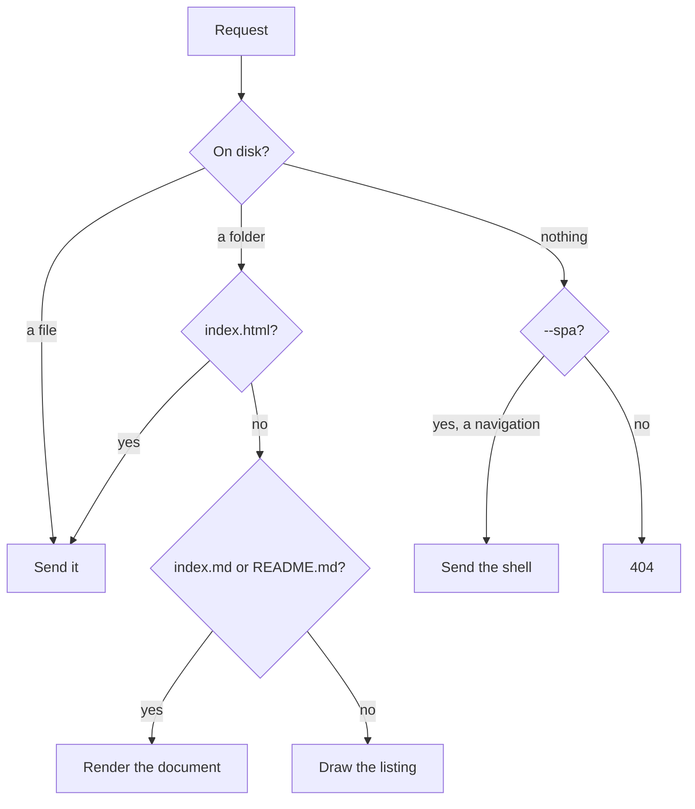
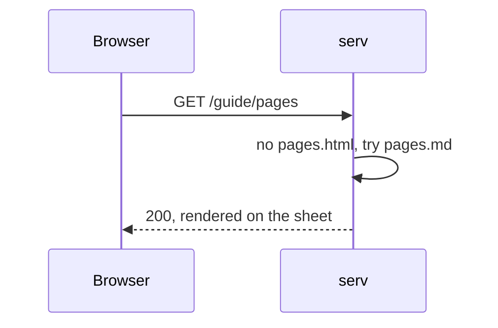

# serv, reading markdown

This folder exists to be served. Run it from the repository root:

```bash
serv -m example
```

Every block below is here to be looked at rather than read — if one of them
renders wrongly, that is the bug. The page you are on is `README.md`, picked
because the folder has no `index.html` and no `index.md`.

## Prose and typography

A paragraph with *emphasis*, **strong**, `inline code`, ~~struck through~~ and a
[link to the guide](guide/index.md). Smart punctuation is on, so "these quotes"
should be curly, 'these' too, and an em dash --- like that one --- should not be
three hyphens. An ellipsis... should be one character.

> A blockquote, for the sentence that deserves setting apart. It runs to two
> lines so the left rule has something to measure itself against.
>
> — and a second paragraph inside it

## Links

| Written | Should become |
| --- | --- |
| `[g](guide/index.md)` | [g](guide/index.md) — folds to the folder |
| `[p](guide/pages.md)` | [p](guide/pages.md) — loses the extension |
| `[a](guide/pages.md#anchors)` | [a](guide/pages.md#anchors) — keeps the fragment |
| `[e](https://example.com)` | [e](https://example.com) — opens in a new tab |
| `[m](mailto:you@example.com)` | [m](mailto:you@example.com) — stays in this tab |
| `[s](#lists)` | [s](#lists) — untouched |
| `[i](assets/square.svg)` | [i](assets/square.svg) — untouched |

## Lists

- A plain item
- An item with `code` and a [link](guide/pages.md) in it
- A nested list:
  - one
  - two
    - deeper
1. Ordered, first
2. Ordered, second

- [x] A task that is done
- [ ] One that is not
- [ ] One with a [link](guide/index.md) in it

## Code

Highlighted only when serv was built with `--features highlight`; plain
monospace otherwise. A fence in a language nothing knows falls back to plain.

```rust
/// The clean URL a `.md` link resolves to.
fn page_url(dest: &str) -> Option<String> {
  let cut = dest.find(['#', '?']).unwrap_or(dest.len());
  let (path, suffix) = dest.split_at(cut);
  let stem = path.strip_suffix(".md")?;
  Some(format!("{stem}{suffix}"))
}
```

```bash
serv -m example -p 8099   # the folder this file is in
```

```json
{ "name": "serv", "markdown": true, "highlight": false }
```

```nosuchlanguage
this fence names a language nothing has a grammar for
and should come out plain
```

    An indented block, which is code without a fence.

## A diagram





## A table

| Flag | Meaning | Default |
| --- | --- | --- |
| `-m`, `--markdown` | Render `.md` files as pages | off |
| `-e`, `--ext` | Require the `.html` extension | off |
| `-p`, `--port` | Port to listen on | `8010` |
| `-s`, `--spa` | Fall back to an app shell | off |

## Images

An SVG, so it needs nothing fetched:


## Raw HTML

Written by hand and passed through untouched: press <kbd>ctrl</kbd> + <kbd>c</kbd>
to stop the server.

<details>
  <summary>A details element, collapsed</summary>

  With a paragraph inside it, which markdown does not touch.
</details>

## Footnotes

A claim that needs support[^1], and another[^long].

[^1]: The support, set small at the foot of the page.
[^long]: A longer note, with `code` and a [link](guide/index.md) in it.

## Headings, for the anchors

Hover one and a § should appear in the margin. Two headings with the same words
should still get different anchors.

### Repeated

### Repeated

---

That rule above is an `---`, not front matter — front matter only counts at the
very top of the file.
